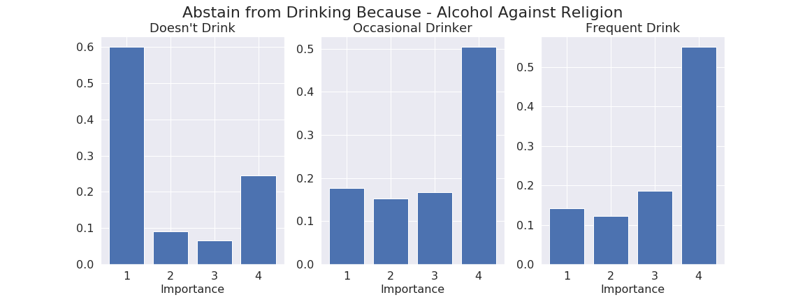
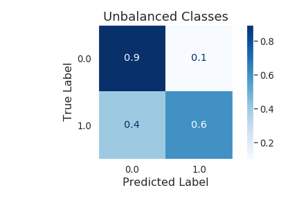
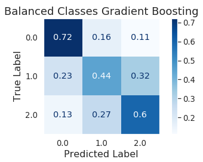

# Alcohol-Consumption-Predictions
Using Alcohol Research Group NAS Datasets from 1990-2010, predict the frequency of alcohol consumption of individuals based on demographic, geographic and behavioral information. 

Used Clustering and Random Forest in an attempt to impute the missing labels on the new behavioral features, but both model predictions had very low correlation to the test data.

# Alcohol Consumption

# Why Alcohol?
While in the miltary 10 years ago I was exposed to(and participated in) a lot of heavy drinking. It seemed a normal activity at the time, but I noticed some surprised reactions from people when discussing alcohol consumption in a military environment and it made me question, "Is this actually normal, or is my perception of what is considered heavy drinking skewed?"
Never having this opportunity to look at data about drinking trends, I was unable to answer that question. My goal for this project is to look at drinking trends and discover not what people consider heavy drinking, but how much people actually participate in drinking.

# Data Source
The data for this project comes from five different datasets provided by the Alcohol Research Group, spanning from 1990 through 2010. The datasets were created from phone questionnaires, so the data is self-reported. Each dataset contains 4000-7000 rows, detailing an individuals responses to alcohol related questions. The final dataset contains nearly 28,000 records. Each dataset contains 600-700 columns corresponding to each question on the questionnaire.
The datasets are not open source. Permissions must be granted from the Study Director to access the data.

[Link to ARG National Alcohol Survey Datasets](http://arg.org/nas-datasets/ "NAS Datasets")

# Data Wrangling 
Cleaning and organizing the data was a daunting task. Each dataset had nearly the same data, but formatted in slightly different ways. Most of the values did not represent the exact same thing. For example, the state codes in each dataset were not the same, so a dictionary for each individual dataset had to be created to match the values to their respective state names. Great attention to detail was required to ensure my final dataframe had consistent and accurate data. Many of the bevioral questions promtped for a numeric answer from 1-4 to represent relative importance of the question. These features had roughly 10% of their values as either null, or the participant failed to respond so an arbitrary number was inserted. These points were imputed from the probability of the existing values since the null data points seemed to be evenly spread with no apparent trend. The value could not be inputed with a standard mean or mode due to the fact that the existing data was parabolic, and the mean or mode would skew the data in one direction or the other

## Understanding the Data Values
Much of my analysis involved comparing the frequency of drinking among different demographics. The values are initially somewhat counter-intuitive, but easy to understand with a reference table. The questionnaire answers to drinking frequency consist of a numeric value between 1 and 11(1 corresponds to extremely heavy drinking, 11 corresponds to never had a drink). These values are used in questions about wine consumption, beer consumption, liquor consumption, and average alcohol consumption regardless of alcohol type. A complete table is provided below for reference. These values will be used later in class selection and modeling.

Drinking Frequency Chart:

| Value | Description |
| --- | --- |
| 1 | Drink 3 or more times a day |
| 2 | Drink 2 times a day |
| 3 | Drink once a day |
| 4 | Drink nearly every day |
| 5 | Drink 3 or 4 times a week |
| 6 | Drink 1 or 2 times a week |
| 7 | Drink 2 or 3 times a month |
| 8 | Drink about 1 time a month |
| 9 | Drink less than 1 time a month |
| 10 | Drink less than 1 time a year |
| 11 | Never had a drink |

# Goal
The goal of this project is to build a model to predict a label for a 3-class engineered feature. The three classes will correspond to drinking frequency: 0 - Never drink; 1 - drinks occasionally(at most once a month); 2 - Drinks frequently(at least once a week). 

# EDA
After selection of features, each one was split into three groups corresponding to the target value to  visualize a difference in their distributions. The feature regarding the participants education, and also the his/her religion's opinions of alcohol seemed the most promising of the behavioral fetures.
The values here range from 1-4, corresponding to level of importance. 1 means the participant felt it is very important, though 4, menaing not important at all.

This was the most dramatic difference between the classes of drinkers. Of those who never drink, 57% answered that how their religion views alcohol is a very important reason to abstain from consumiung alcohol, while only 12% of frequent drinkers asnwered with a 1. 

Here the x-axis corresponds directly with the number of years of school completed; 12 means that he/she completed high school, and 16-17 implies completeion of undergrad school. Most people associate college with partying, so a spike in those with a college level education is not surprising.

# Processing

To begin preparing the data for modeling, the features which were not ordinal(state, ethnicity, etc.) had to be one-hot encoded to prevent the model from incorrectly interpreting certain arbitrary values to be greater than others. 
The second step was to impute the missing values in a few columns. Given the nature of the distribution in said columns, imputing with the mode or mean would artificially inflate one of the 4 classes; the outside values - 1 and 4 - were substantially higher than the middle two. For this reason, the datapoints were imputed with a random value based on the probabily of that value occuring (e.g.  np.random.choice([1, 2, 3, 4], p=[0.4, 0.1, 0.1, 0.4]) )

After processing was done, the initial model was a Logisitc Regression model. The intial fit on the raw data shows a clear unbalance among the 2 classes(0 for never drinks, 1 for frequent drinker). The sample of non-drinkers is much larger than the other class, so it's favored by the model. To remedy this the data was balanced by resampling 35% more from the pool of the moniority class(frequent drinkers), while undersampling the majority class to the same number of samples. After this was done, the standard logistic regression model displayed more favorable numbers. 

  

    
  

  

    
  

 

After the baseline was established and the 2 class model showed an acceptable level of signal, the data was then split into 3 classes: 0 for never drinks(11), 1 for occasionaly drinks(7-9), and 2 for frequently drinks(1-6). Using balanced classes and a out-of-the-box gradient boostin model, I tested the accuracy with different values for the classes and found the best starting point for 3 classes was to split by drinking frequency 1-5, 8-9, and 11. This made a more distinct separation between classes. 

  

    
  

  

    
  

 

